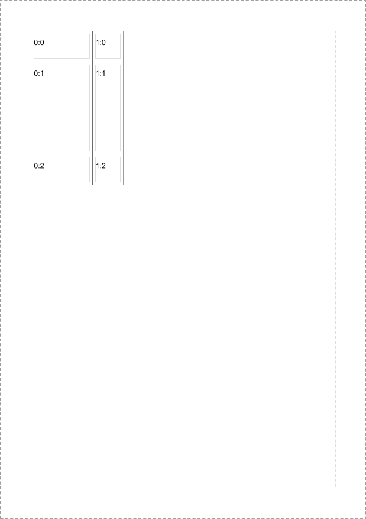

# Grids

## 2 Columns, 3 Rows

```java
RenderGrid<String> renderGrid = RenderGrid.<String>builder()
  .grid(new Grid(Margin.of(5.0f, 5.0f, 5.0f, 5.0f),
    List.of(100.0f, 50.0f),
    List.of(50.0f, 150.0f, 50.0f)))
  .cellBoxDecorator(GridCellDecorator.renderBorder(Color.DARK_GRAY))
  .renderBoxDecorator(GridCellDecorator.renderBorder(Color.LIGHT_GRAY))
  .layouter(new NoSpaceBetweenCellsLayouter())
  .contentLookup(cell -> Optional.of(cell.column()+":"+cell.row()))
  .contentRenderer((column, value) -> column.addElement(new Phrase(value)))
  .build();
```



[3 Columns, 3 Rows PDF](grid-2columns3rows.pdf)
