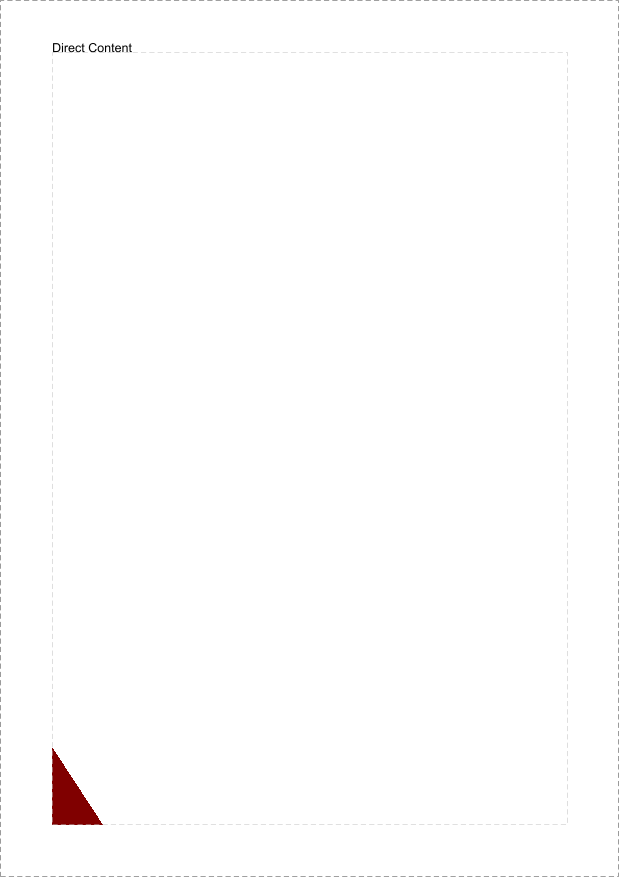
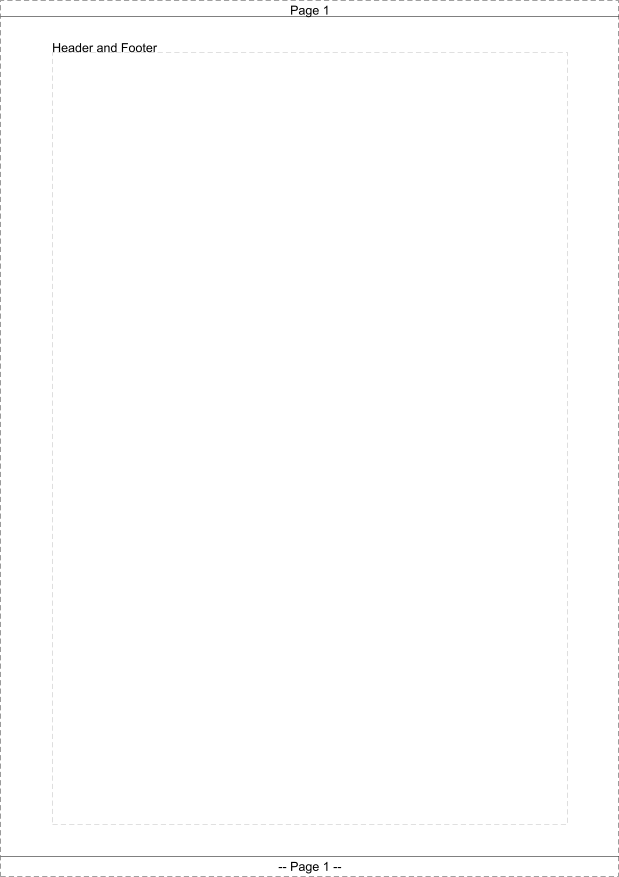

# Page Decorations


## Background Image

```java
DocumentFactory factory = DocumentFactory.builder()
  .pageSize(PageSize.A4)
  .addBlocks(new Text("Background Image"))
  .addOnPageEvents(PageBorders.renderDocumentHints())
  .addOnPageEvents(PageDecorator.builder()
    .elementFactory(pageNumber -> Optional.of(image))
    .boxFactory(doc -> PageBox.fullPageBox(doc)
      .boxAt(new Dimension(50.0f, 50.0f), HorizontalAlignment.LEFT, VerticalAlignment.TOP))
    .build())
  .build();
```


[backgroundImage.pdf](page-backgroundImage.pdf)

## Direct Content

```java
DocumentFactory factory = DocumentFactory.builder()
  .pageSize(PageSize.A4)
  .addBlocks(new Text("Direct Content"))
  .addOnPageEvents(PageBorders.renderDocumentHints())
  .addOnPageEvents(PageDirectContentDecorator.builder()
    .renderer((doc, cb) -> {
      PageBox pageBox = PageBox.innerBox(doc);
      float left = pageBox.left();
      float right = pageBox.left() + pageBox.width() / 10f;
      float bottom = pageBox.bottom();
      float top = pageBox.bottom() + pageBox.height() / 10f;

      cb.setLineWidth(1f);
      cb.setRGBColorFill(128,0,0);
      cb.moveTo(left, bottom);
      cb.lineTo(left, top);
      cb.lineTo(right, bottom);
      cb.lineTo(left, bottom);
      cb.fill();
      cb.resetRGBColorFill();
    })
    .build())
  .build();
```



[directContent.pdf](page-direct-content.pdf)

## Header and Footer

```java
PageDecorator header = PageDecorator.builder()
  .elementFactory(page -> Optional.of(TableElement.builder()
    .columns(TableElement.Columns.relativeWeights(1.0f))
    .addCells(PdfPCellFactory.builder()
      .phrase(PhraseElement.of("Page "+page))
      .cellStyle(CellStyle.empty()
        .withHorizontalAlignment(HorizontalAlignment.CENTER)
        .withBorder(BorderProperty.<BorderStyle>of(BorderStyle.noBorder())
          .withBottom(BorderStyle.of(Color.BLACK, 0.5f))))
      .build())
    .build().create()))
  .boxFactory(document -> PageBox.fullPageBox(document)
    .rowAt(20.0f, VerticalAlignment.TOP))
  .build();

PageDecorator footer = PageDecorator.builder()
  .elementFactory(page -> Optional.of(TableElement.builder()
    .columns(TableElement.Columns.relativeWeights(1.0f))
    .addCells(PdfPCellFactory.builder()
      .phrase(PhraseElement.of("-- Page "+page+" --"))
      .cellStyle(CellStyle.empty()
        .withHorizontalAlignment(HorizontalAlignment.CENTER)
        .withBorder(BorderProperty.<BorderStyle>of(BorderStyle.noBorder())
          .withTop(BorderStyle.of(Color.BLACK, 0.5f))))
      .build())
    .build().create()))
  .boxFactory(document -> PageBox.fullPageBox(document)
    .rowAt(20.0f, VerticalAlignment.BOTTOM))
  .build();

DocumentFactory factory = DocumentFactory.builder()
  .pageSize(PageSize.A4)
  .addOnPageEvents(PageBorders.renderDocumentHints())
  .addBlocks(new Text("Header and Footer"))
  .addOnPageEvents(header, footer)
  .build();
```



[pageHeaderAndFooter.pdf](page-headerRows.pdf)
